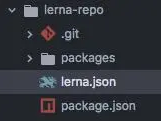

### lerna
官网
https://lerna.js.org/

有用博客
http://www.manongjc.com/article/68827.html

learn的基础使用
https://www.wandouip.com/t5i126916/

基于Lerna管理packages的Monorepo项目最佳实践
https://github.com/morrain/lerna-learning/

### 使用介绍

- 全局安装lerna
````
npm install lerna -g
````
- 初始化我们的项目仓库

先创建一个lerna-repo目录，然后进入此目录运行下面的命令

lerna init //先采用默认模式，生成图lerna1目录结构


- lerna有两种管理模式
  - 固定模式：固定模式，通过lerna.json的版本进行版本管理。
    当你执行lerna publish命令时， 如果距离上次发布只修改了一个模块，将会更新对应模块的版本到新的版本号，然后你可以只发布修改的库
  - 独立模式：独立模式，init的时候需要设置选项 --independent. 独立模式允许管理者对每个库单独改变版本号，每次发布的时候，你需要为每个改动的库指定版本号。
    这种情况下， lerna.json的版本号不会变化了， 默认为independent
    
### lerna.json解析
- version , 当前库的版本
- npmClient , 允许指定命令使用的client， 默认是 npm， 可以设置成 yarn
- command.publish.ignoreChanges ， 可以指定那些目录或者文件的变更不会被publish
- command.bootstrap.ignore ， 指定不受 bootstrap 命令影响的包
- command.bootstrap.npmClientArgs ， 指定默认传给 lerna bootstrap 命令的参数
- command.bootstrap.scope ， 指定那些包会受 lerna bootstrap 命令影响
- packages ， 指定包所在的目录
````
{
  "version": "1.1.3",
  "npmClient": "npm",
  "command": {
    "publish": {
      "ignoreChanges": [
        "ignored-file",
        "*.md"
      ]
    },
    "bootstrap": {
      "ignore": "component-*",
      "npmClientArgs": ["--no-package-lock"]      
    }
  },
  "packages": ["packages/*"]
}
````    

### 命令行
- lerna publish 发布新的库版本
- lerna version 这个命令 识别出修改的包 --> 创建新的版本号 --> 修改package.json --> 提交修改 打上版本的tag --> 推送到git上
- lerna bootstrap 
  - 为每个包安装依赖
  - 链接相互依赖的库到具体的目录
  - 执行 npm run prepublish
  - 执行 npm run prepare
````
lerna bootstrap --npm-client=yarn
````
- lerna list 列举当前lerna 库包含的包
- lerna changed 显示自上次relase tag以来有修改的包， 选项通 list
- lerna diff 显示自上次relase tag以来有修改的包的差异， 执行 git diff
- lerna exec 在每个包目录下执行任意命令
````
lerna exec -- <command> [..args] # runs the command in all packages
lerna exec -- rm -rf ./node_modules
lerna exec -- protractor conf.js
lerna exec -- npm view \$LERNA_PACKAGE_NAME
lerna exec -- node \$LERNA_ROOT_PATH/scripts/some-script.js
````
- lerna run 执行每个包package.json中的脚本命令
````
lerna run <script> -- [..args] # runs npm run my-script in all packages that have it
lerna run test
lerna run build

watch all packages and transpile on change, streaming prefixed output
lerna run --parallel watch
````
- lerna init 创建一个新的lerna库或者是更新lerna版本
  - 修改package.json中lerna版本
  - 创建lerna.json
- lerna add 添加一个包的版本为各个包的依赖
````
lerna add <package>[@version] [--dev] [--exact]
````
- lerna clean 删除各个包下的node_modules
- lerna import 导入指定git仓库的包作为lerna管理的包
````
lerna import <path-to-external-repository>
````
- lerna link 链接互相引用的库
- lerna create 新建包
````

````